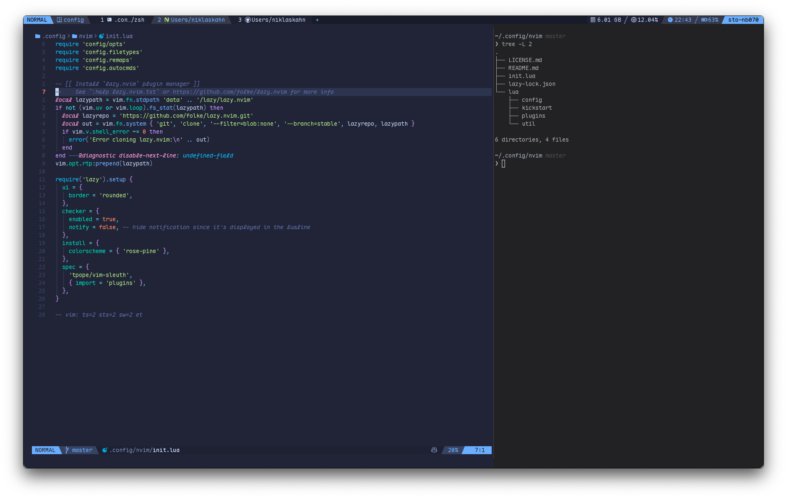

# dotfiles



## Quickstart

I use the symlink approach to work with my dotfiles. Run this to get set up:

1. `git clone --recurse-submodules git@github.com:niklas-r/dotfiles.git ~/dotfiles`
2. `cd ~/dotfiles`
3. `./install` (or `./install --dry-run` if you want to check the actions first)

## Submodules

This project contains a few submodules. To update these, run:

```sh
git pull
git submodule sync --recursive
git submodule update --init --recursive
```

## Required tools

### Font

You need a Nerdfont for the best experience.

I like to change things up quite often, I currently use [Maple Mono](https://github.com/subframe7536/maple-font)

### Terminal emulator

My current terminal of choice is [Wezterm](https://wezterm.org). Checkout my config in [`.config/wezterm`](./.config/wezterm)!

### Shell

I use [`zsh`](https://www.zsh.org/) with [`Prezto`](https://github.com/sorin-ionescu/prezto) and [`antidote`](https://antidote.sh/).

### Package managers

- [Homebrew](https://brew.sh/)
- [`nvm`](https://github.com/nvm-sh/nvm)

### CLI tools

I use a lot of CLI tools, here's a list of the stuff I remembered installing. Most of which can be installed with Homebrew.

- [git](https://git-scm.com/) (duh)
- [Neovim](https://neovim.io/)
- [bat](https://github.com/sharkdp/bat)
- [lazygit](https://github.com/jesseduffield/lazygit)
- tree
- [yazi](https://github.com/sxyazi/yazi)
- [fzf](https://github.com/junegunn/fzf)
- [gh](https://cli.github.com/)
- [delta](https://dandavison.github.io/delta/)
- [zoxide](https://github.com/ajeetdsouza/zoxide)
- [ripgrep](https://github.com/BurntSushi/ripgrep)
- [jq](https://github.com/jqlang/jq)
- [tldr](https://github.com/tldr-pages/tldr)

### Container tools

- [Orbstack](https://orbstack.dev/)
